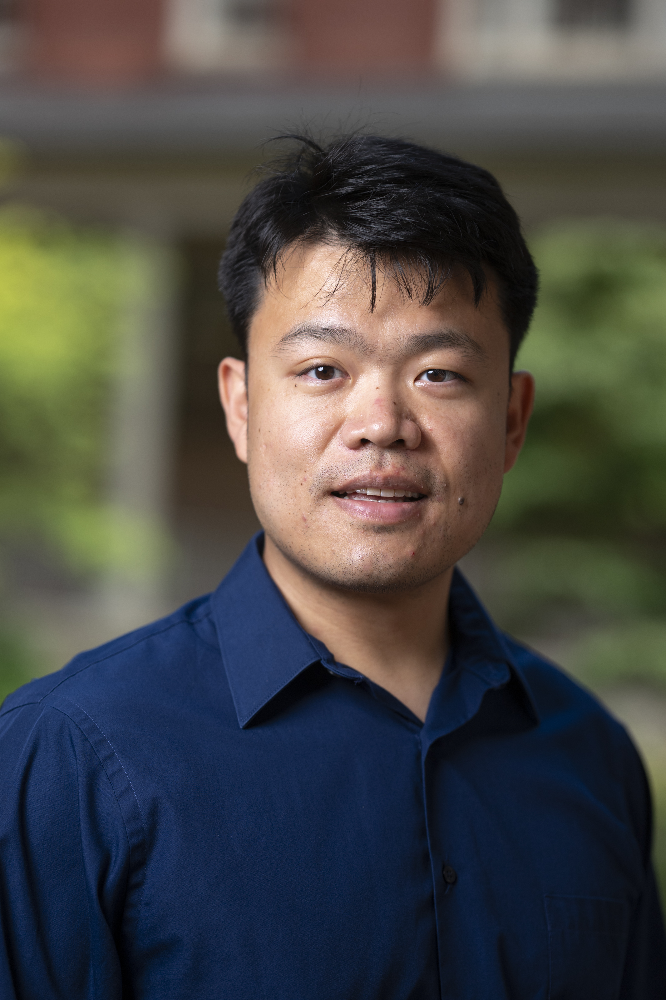
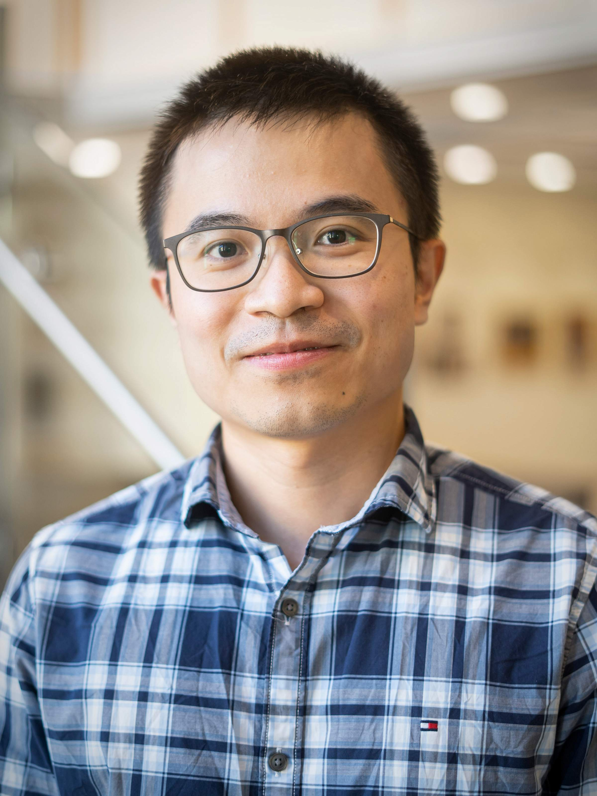
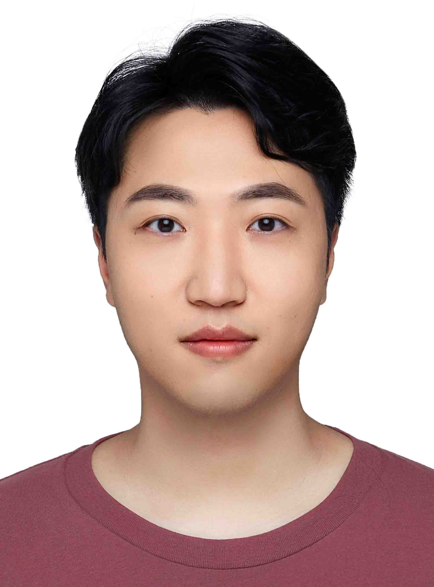
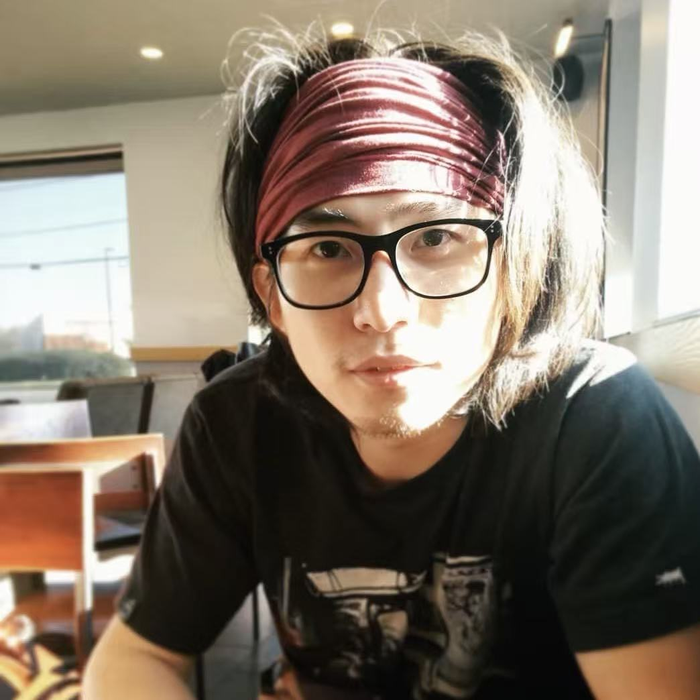

::: {.members-intro}
Meet the people behind the lab's research.
:::

## Current Members

::: {.member-grid}

::: {.member-card}
{.member-photo}

**Boyi Guo, PhD**\
*Principal Investigator*

[email](mailto:boyi.guo@hsc.utah.edu) &middot; [website](https://boyi-guo.com)
:::

::: {.member-card}
{.member-photo}

**Tengda Lin**\
*PhD Student*

[email](mailto:Tengda.Lin@hci.utah.edu) <!-- &middot; [website](https://www.linkedin.com/in/tegnda-lin-1a0b3b1b6/) -->
:::

::: {.member-card}
{.member-photo}

**Huiqian Hu, PhD**\
*Visiting Postdoctoral Researcher*

[email](mailto:hhuaq0612@gmail.com)  &middot; [website](https://scholar.google.com/citations?user=_sOXxKgAAAAJ&hl=en)
:::

::: {.member-card}
{.member-photo}

**Shangjie Guo, PhD **\
*Visiting Research Scientist*

[email](mailto:shangjie.guo@gmail.com) &middot; [website](https://www.linkedin.com/in/shangjie-guo/)
:::

::: {.member-card}
{.member-photo}

**Yu Fang**\
*Visiting PhD Student*

[email](mailto:fangyu2045@gmail.com) &middot; [website](https://scholar.google.com/citations?user=YH9fOlsAAAAJ&hl=en)
:::

:::

## Alumni and Friends
- **Sophia Huebler** — Rotation PhD Student in Biostatistics (2025–2026), T32 ODSi Predoctoral Fellow (2025–2027)
- **Jax Lubkowitz** — Collaborating PhD Student in Biomedical Informatics (2025–2026)
- **Li Li, PhD** —  Collaborating Staff Scientist(2026–Present) → Huntman Cancer Institute
<!-- - **Chris Park** — Research Assistant (2022–2023) → now PhD Student, Example University -->
<!-- - **Priya Patel** — Rotation Student (2023) → now PhD Student, Another University -->
